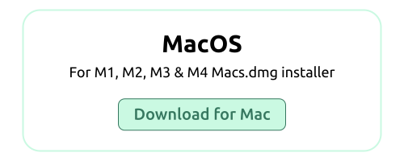
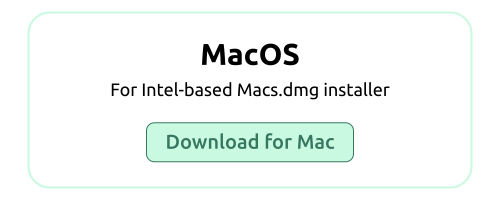
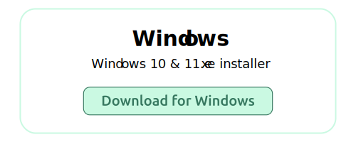
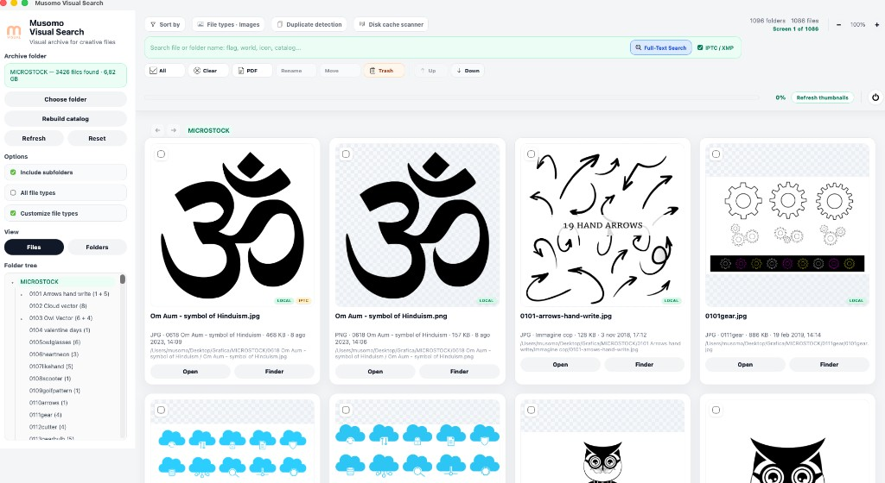
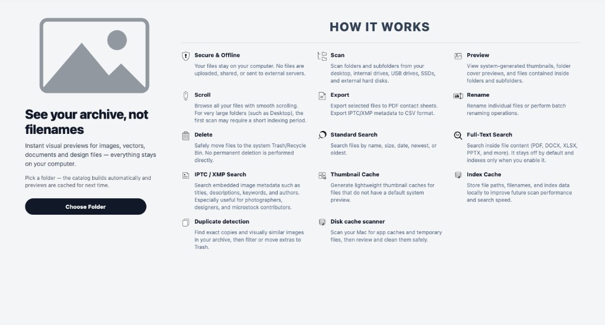
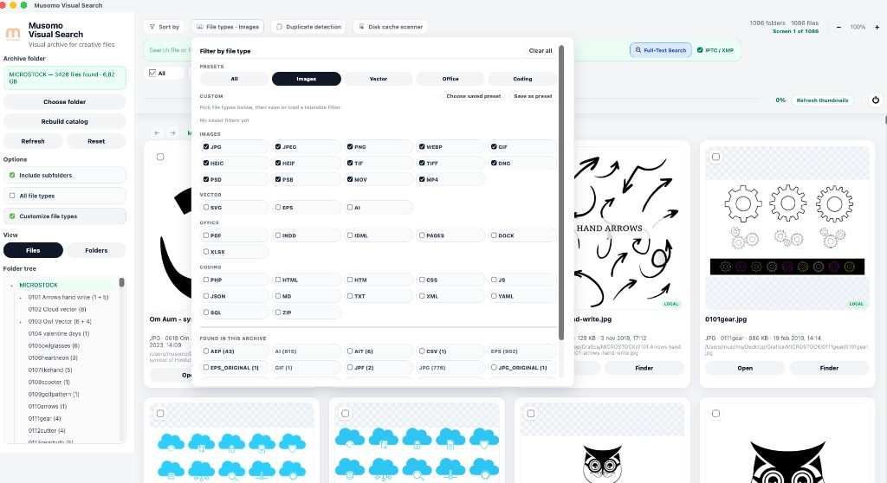
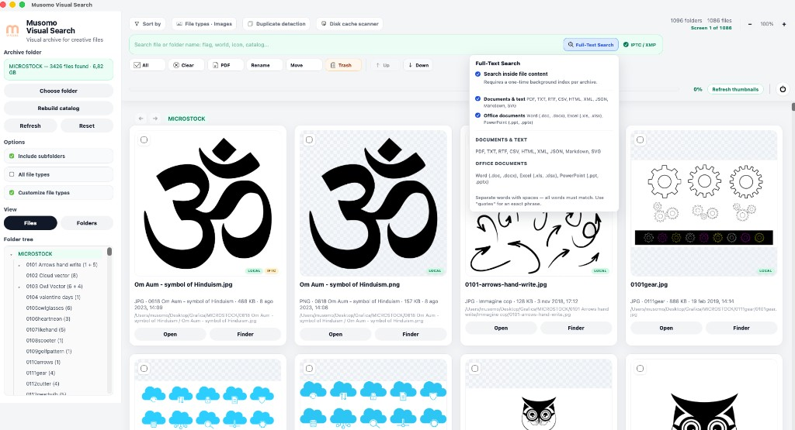
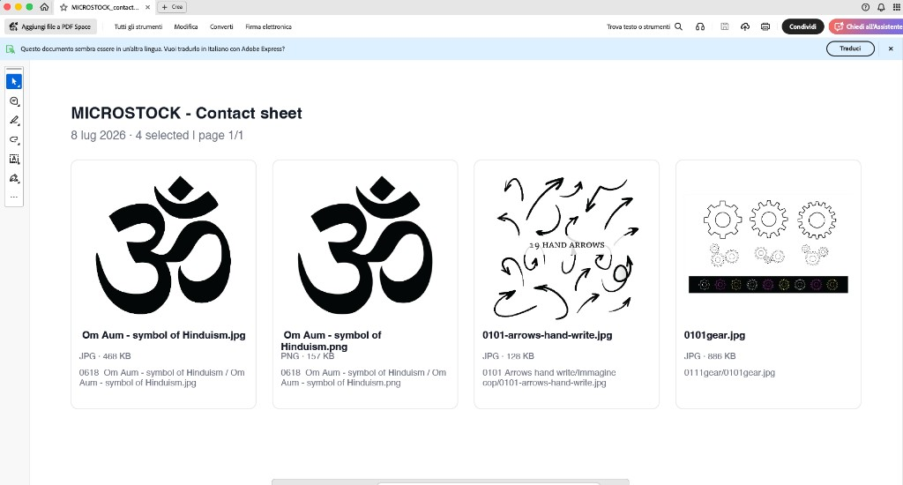
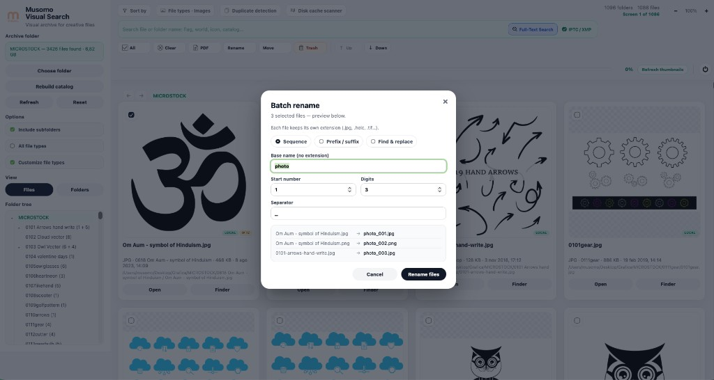
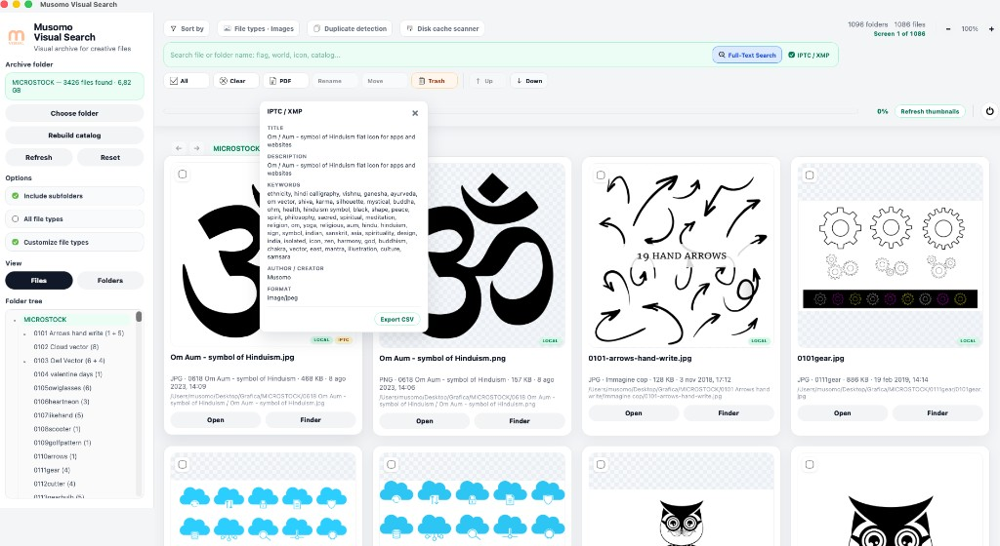

<div align="center">


# Musomo Visual Search

### See your entire creative archive at a glance

**LOCAL-FIRST · MACOS & WINDOWS · PRIVATE BY DESIGN**

Musomo Visual Search turns folders on your computer into a visual catalog — images, PDFs, vectors, Office documents, and more — with thumbnails, search, and export. Nothing uploads to the cloud.

Built for designers, photographers, illustrators, studios, and anyone managing large local archives.

</div>

---

## Download

Choose the installer for your operating system. Replace the placeholder links below with your release URLs before publishing.

<div align="center">

<a href="YOUR_MACOS_ARM_LINK">
  
</a>
<a href="YOUR_MACOS_INTEL_LINK">
  
</a>
<a href="YOUR_WINDOWS_LINK">
  
</a>

</div>

| Platform | Direct link |
|---|---|
| **macOS Apple Silicon** | [Download for Mac](YOUR_MACOS_ARM_LINK) |
| **macOS Intel** | [Download for Mac](YOUR_MACOS_INTEL_LINK) |
| **Windows 10 & 11** | [Download for Windows](YOUR_WINDOWS_LINK) |

> **Before publishing:** set `YOUR_MACOS_ARM_LINK`, `YOUR_MACOS_INTEL_LINK`, and `YOUR_WINDOWS_LINK` to the direct download URLs from your public GitHub Releases page.

---

## The app

### Visual catalog

Browse thousands of creative files as thumbnails instead of filenames. Filter by extension, sort by size or date, and navigate folder trees at speed.

<div align="center">

</div>

### Welcome & onboarding

A clear first-run experience walks you through folder selection, privacy, and how Musomo builds your local catalog.

<div align="center">

</div>

---

## Features

### Full-Text Search (opt-in)

Search inside supported documents — PDF, TXT, Office files, and more. Disabled by default for faster first launch; enable it when you need deeper search across your archive.

<div align="center">

</div>

### File type filters

Focus on the formats you care about — JPG, PNG, PDF, PSD, AI, video, and dozens more — with quick presets and custom extension lists.

<div align="center">

</div>

### IPTC / XMP metadata

Search and inspect embedded metadata — keywords, captions, copyright, creator — without leaving the app.

<div align="center">

</div>

### Batch rename

Rename single files or entire selections with live preview, undo support, and safe conflict handling.

<div align="center">

</div>

### PDF contact sheet export

Export a polished contact sheet of your current selection — ideal for client reviews, mood boards, and archive documentation.

<div align="center">

</div>

---

## Why Musomo

| | |
|---|---|
| **Visual browsing** | Turn folders into a thumbnail-based catalog for images, PDFs, vectors, and mixed creative files. |
| **Private by design** | Files stay on your computer. No mandatory cloud upload, no external storage workflow. |
| **Built for real archives** | Scan large folder trees, filter file types, sort by size/date, export selections, and clean up clutter. |
| **Professional search** | Filename search, IPTC/XMP metadata search, and opt-in full-text search for supported document formats. |
| **Power tools** | Duplicate detection, disk cache scanner, batch rename, and multi-language interface (EN, IT, ES, FR, DE). |

---

## Privacy

Your files stay on your machine. Musomo works locally and keeps previews, metadata, and indexes on your computer — not on external servers.

| Principle | Details |
|---|---|
| **Files stay local** | Musomo works on folders on your machine and does not require cloud upload. |
| **Local cache only** | Preview cache, metadata cache, and full-text index are stored locally. |
| **Opt-in indexing** | Full-text indexing starts only when the user explicitly enables it. |
| **User-controlled cleanup** | Generated cache and previews can be reviewed and cleared when needed. |

---

## System requirements

| System | Requirement |
|---|---|
| **macOS** | macOS 12+ recommended |
| **Windows** | Windows 10 or Windows 11 |
| **Storage** | Enough disk space for previews, cache, and local indexes |
| **Internet** | Not required for normal use after installation |

---

## Technical notes

Musomo Visual Search is a **Tauri 2** desktop application.

| Layer | Description |
|---|---|
| **UI** | Single-page web frontend bundled with the app |
| **Backend** | Rust — file scanning, thumbnail generation, metadata extraction, local indexes |
| **Full-text index** | Opt-in content index for supported document formats (`PDF`, `TXT`, `RTF`, `CSV`, `HTML`, `XML`, `JSON`, `Markdown`, `SVG`, `DOC`, `DOCX`, `XLS`, `XLSX`, `XLSM`, `PPT`, `PPTX`) |
| **Platforms** | macOS (Apple Silicon & Intel), Windows |
| **Offline** | Works without an internet connection after installation |

### Supported file types (preview & catalog)

Common creative formats including JPG, PNG, WEBP, SVG, PDF, AI, EPS, PSD, TIFF, MP4, MOV, and Office documents. Preview availability may vary by operating system and installed system services.

### Build from source

```bash
npm install
npm run tauri dev
npm run tauri build
```

Requires Node.js, Rust, and platform-specific Tauri dependencies.

---

## Learn more

Product website: **[visual.musomo.net](https://visual.musomo.net/)**

---

<div align="center">

**Musomo Visual Search**

Fast. Private. Visual.

Built for real-world creative archives on desktop.

</div>

---

<details>
<summary><strong>Repository setup (for maintainers)</strong></summary>

### Suggested GitHub repository name

- `musomo-visual-search`

### GitHub tagline

`Visual file browser for creative archives on macOS and Windows.`

### Short description

`Musomo Visual Search is a local-first desktop app for browsing creative folders visually with thumbnails, search, filters, metadata, and opt-in full-text search.`

### Website field

`https://visual.musomo.net`

### Suggested topics

`tauri`, `desktop-app`, `macos`, `windows`, `file-browser`, `asset-management`, `creative-tools`, `image-browser`, `local-first`, `visual-search`, `metadata`, `full-text-search`

### Publishing checklist

1. Copy this `README.md` and the `assets/` folder into the root of your public repository.
2. Replace the three `YOUR_*_LINK` placeholders with real release download URLs.
3. Confirm screenshots render correctly on GitHub.
4. Add a `LICENSE` file if you plan to publish source code.
5. Upload a social preview image (1280×640) — logo + catalog screenshot works well.

</details>
